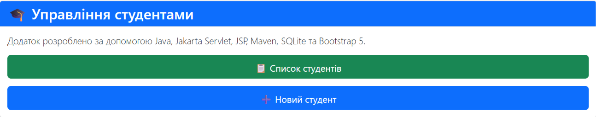
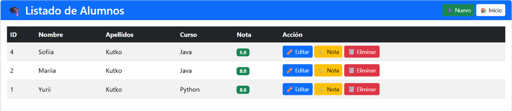
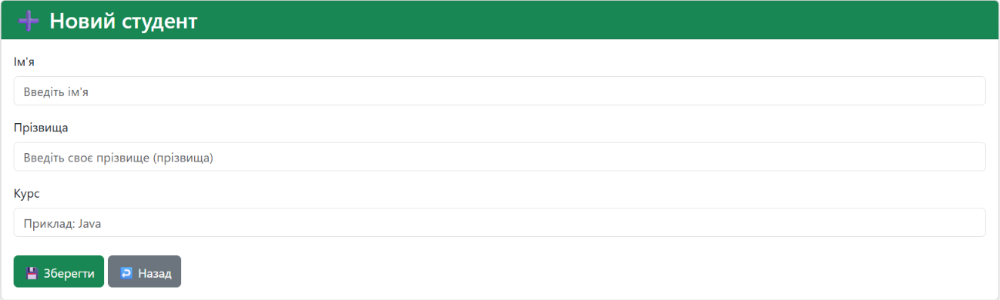
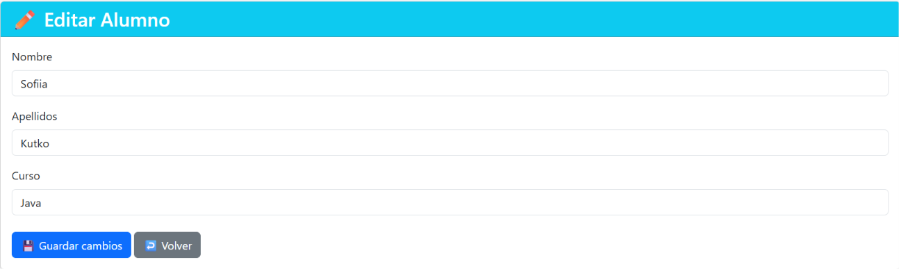
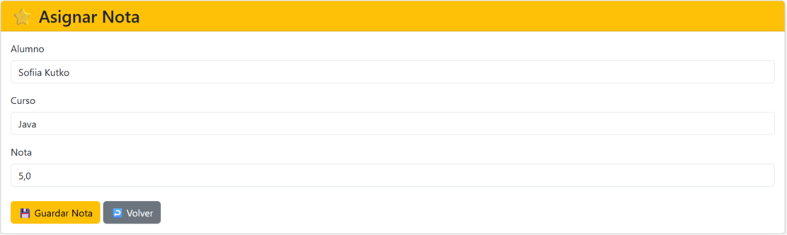

# 🎓 Alumnos MVC

Aplicación web para la gestión de alumnos desarrollada con Java siguiendo el patrón MVC.


**Características principales:**

- Gestión de alumnos
- Asignación de notas
- Base de datos SQLite
- Interfaz con Bootstrap 5

## Tecnologías utilizadas

- Java 21
- Jakarta Servlet
- JSP
- Maven
- SQLite
- Bootstrap 5
- Apache Tomcat 11
- Git y GitHub

## 🏗️ Arquitectura

El proyecto sigue el patrón MVC (Model-View-Controller).

- **Model** → Clase `Alumno`
- **DAO** → Acceso a la base de datos SQLite
- **Servlet** → Controlador principal
- **JSP** → Vistas de la aplicación

## Funcionalidades

- ✅ Listado de alumnos
- ✅ Crear alumno
- ✅ Editar alumno
- ✅ Asignar nota
- ✅ Almacenamiento en SQLite

## 📸 Capturas de pantalla

### 🏠 Página principal



### 📋 Listado de alumnos



### ➕ Nuevo alumno



### ✏️ Editar alumno



### ⭐ Asignar nota



## Estructura del proyecto

```
src/
 ├── main/
 │   ├── java/
 │   └── webapp/
 └── pom.xml
```

## 🚀 Cómo ejecutar

### Requisitos

- Java 21
- Apache Tomcat 11
- Maven 3.9+

### Pasos

1. Clonar el repositorio.
2. Abrir el proyecto con IntelliJ IDEA o Visual Studio Code.
3. Ejecutar Maven.
4. Desplegar el archivo WAR en Apache Tomcat.
5. Abrir el navegador en:

```
http://localhost:8080/alumnosmvc
```

## 🚀 Próximas mejoras

- 🔍 Buscar alumnos
- 🗑️ Eliminar alumnos
- 📊 Estadísticas de notas
- 🌐 Migración a Spring Boot
- 🔐 Sistema de autenticación

## 📦 Versión

**v1.0**

## Autor

**Yurii Kutko**
